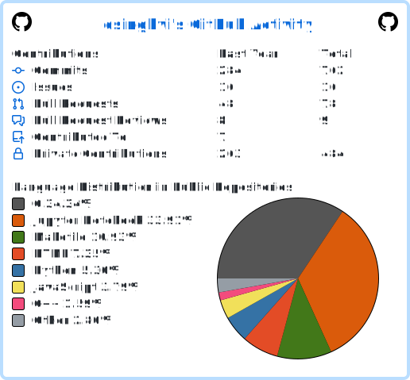

# 👋 Hi, I’m Divyansh Singhvi  

## 🚀 About Me
<!-- - 📖 Co-author of an ACL 2025 paper on interpretability in LLMs  -->  
<!-- - 🧑‍💻 Open-source contributor (vLLM, PyTorch, mechanistic interpretability repos)  -->
- 🌱 Currently exploring **reinforcement learning** & **mechanistic interpretability**  
- 💡 I enjoy building **scalable ML infra**, doing **applied research**, and **teaching/explaining ideas**  

---

 

<!-- - Used (https://github.com/cicirello/user-statistician) to generate -->

---

## 🔗 Connect with Me

  
  
  

---

